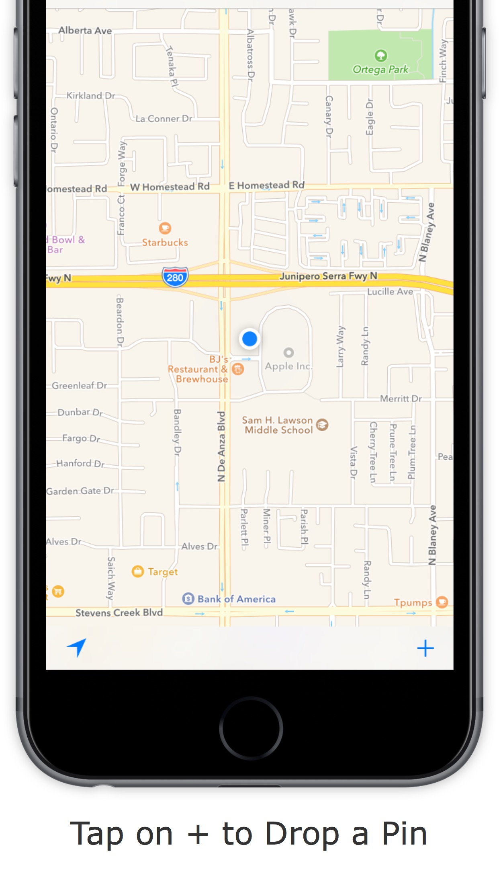
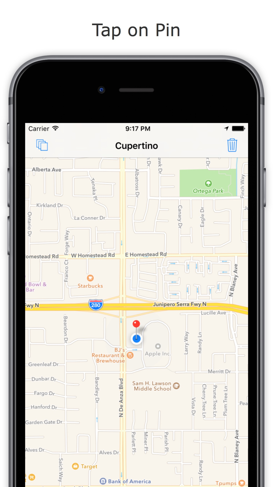
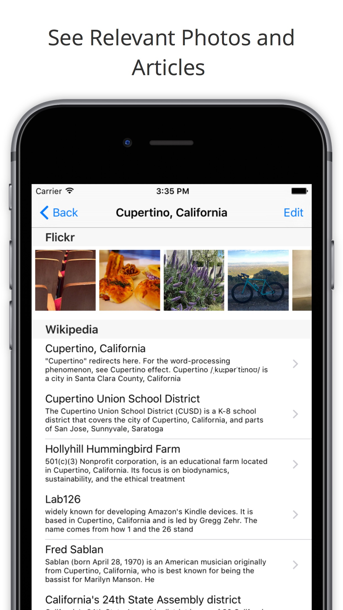
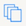
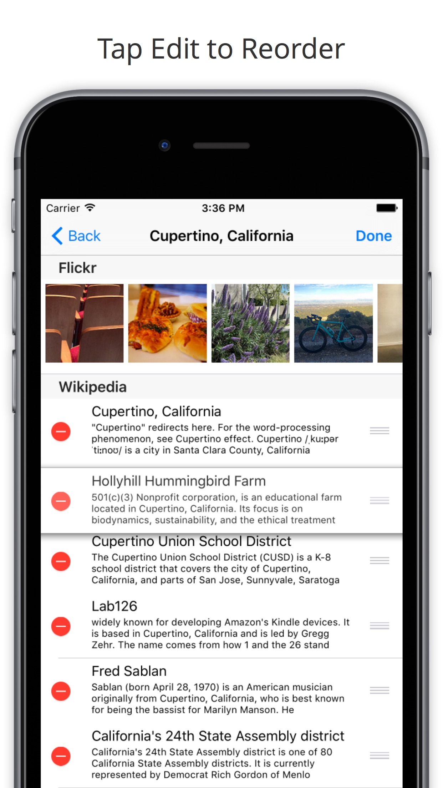
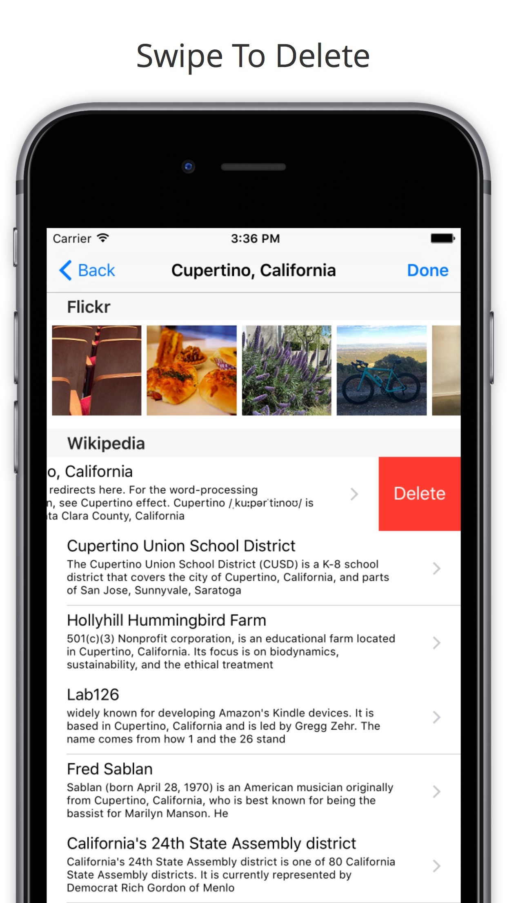
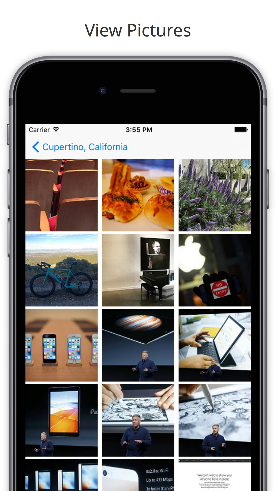
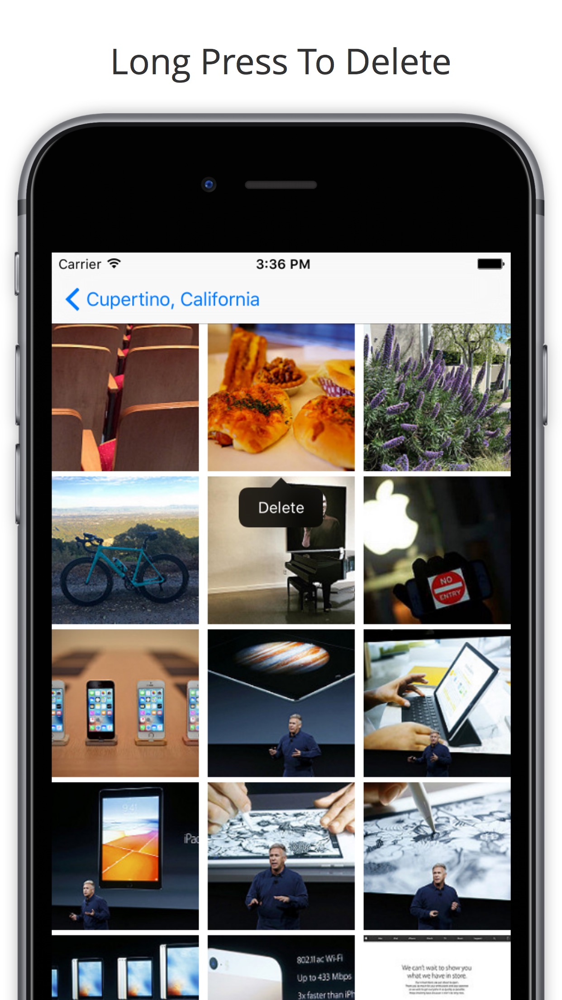

# SiteSee  

 

Discover neighborhoods, cities and countries around the world!

## Download

_Apple and the Apple logo are trademarks of Apple Inc., registered in the U.S. and other countries. App Store is a service mark of Apple Inc._

## Feedback
Github user? [Add an Issue here](https://github.com/tomtclai/SiteSee/issues)

Not github user? [Fill out the form here](https://docs.google.com/forms/d/1oCb8PoIk4_8OdZVPJP11OBJk2SgWbZHwnVqLEhC02M0)

## User Guide

### Start using the application
- Use the  button to add a pin
- Tap on a pin to see relevant photos from Flickr and Wiki pages 

  |  
----|----
  | 

#### Other things you could do from the home screen...

Button | What it does
----|----
 | Change from standard maps to a satellite / hybrid one, or vice versa
 | Delete all pins from the map
 | Show your location on the map

### Managing media for a location

- Swipe to delete articles tied to the location
- Tap on the row of pictures to expand the view
- Long Press to delete any photos you don't want 

  |  
----|----
  | 

## Development environment setup

1. Install Xcode 7.3
2. Install iOS 9.3
3. `git clone` this project
4. Open `SiteSee.xcodeproj`

