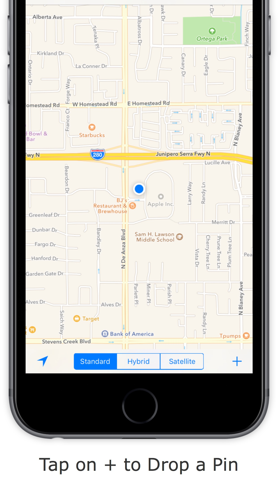

# SiteSee
Learn about the neighborhoods, cities, countries (and seas!) around the world.

<!-- Screenshots here -->

 | |  |
|---|---|---
| |  |  
| |  |   |

### Development environment setup

1. Install Xcode 7.3
2. Install iOS 9.3
3. `git clone` this project
4. Open `SiteSee.xcodeproj`
