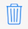

# SiteSee
Learn about the neighborhoods, cities and countries around the world!

<!-- Screenshots here -->

##User Guide

###Start using the application
- Use the  button to add a pin
- Tap on a pin to see relevant photos from Flickr and Wiki pages 

  |  
----|----
  | 

####Other things you could do from the home screen...

Button | What it does
----|----
 | Change from standard maps to a satellite / hybrid one, or vice versa
 | Delete all pins from the map
 | Show your location on the map

###Managing media for a location

- Swipe to delete articles tied to the location
- Tap on the row of pictures to see expand the view
- Long Press to delete any photos you don't want 

  |  
----|----
  | 

## Development environment setup

1. Install Xcode 7.3
2. Install iOS 9.3
3. `git clone` this project
4. Open `SiteSee.xcodeproj`
